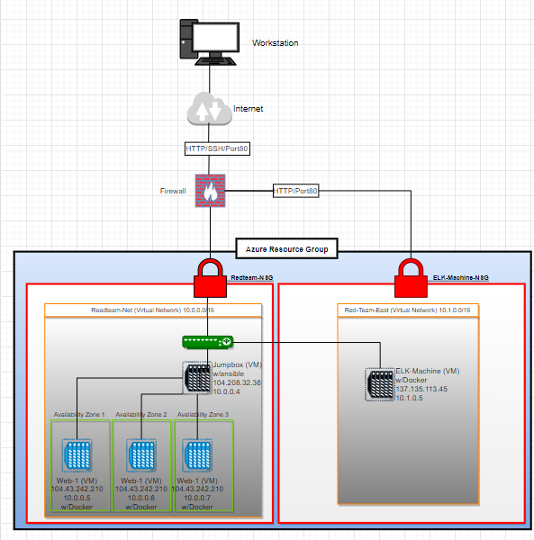
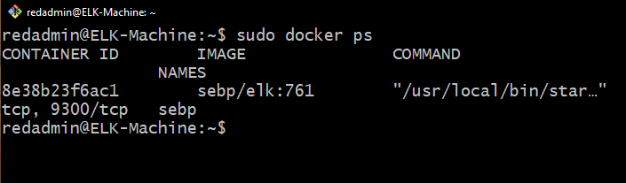

## Automated ELK Stack Deployment

The files in this repository were used to configure the network depicted below.

These files have been tested and used to generate a live ELK deployment on Azure. They can be used to either recreate the entire deployment pictured above. Alternatively, select portions of the YAML file may be used to install only certain pieces of it, such as Filebeat.

[My ELK Playbook](https://github.com/Damienrlee/Project-1/blob/master/Ansible/elk_playbook.yml "ELK Playbook")    

This document contains the following details:
- Description of the Topology
- Access Policies
- ELK Configuration
  - Beats in Use
  - Machines Being Monitored
- How to Use the Ansible Build

### Description of the Topology

The main purpose of this network is to expose a load-balanced and monitored instance of DVWA, the D*mn Vulnerable Web Application.

Load balancing ensures that the application will be highly protected, in addition to restricting traffic to the network.

Aspect of security that load balancers protect:
   
   Azure Load Balancer operates at layer four of the (OSI) model and protects servers from becoming overloaded and possibly crashing. If one server goes down, the load balancer redirects traffic to the remaining servers online. When a new server is added to the server group, the load balancer automatically starts to send requests to it. In other words, load balancing helps improve availability and prevent downtime.
   
The advantages of a jump box:
   
   A jump box prevents Azure VMs from being as exposed to the public. This means that the jumbox will be the entry point for connecting via (RDP) from the on-premise network. It also helps to only have one port open instead of several ports to connect different VMs present in the Azure resource group.

Integrating an ELK server allows users to easily monitor the vulnerable VMs for changes to the logs and system traffic.

What does Filebeat watch for?
  
  Filebeat watches and monitors the log files or locations that users specify, collects log events, and forwards them either to Elasticsearch or Logstash for indexing. Filebeat is a lightweight shipper for forwarding and centralizing log data. Installed as an agent on the server.

What does Metricbeat record?
  
  Metricbeat is a lightweight shipper that records and periodically collects metrics from the operating system and from services running on the server and takes the metrics and statistics that it collects and ships them to the output that users specify, such as Elasticsearch or Logstash.

The configuration details of each machine may be found below.
_Note: Use the [Markdown Table Generator](http://www.tablesgenerator.com/markdown_tables) to add/remove values from the table_.

| Name                 | Function   | IP Address | Operating System |
|----------------------|------------|------------|------------------|
| Jump-Box-Provisioner | Gateway    | 10.0.0.4   | Linux            |
| Web-1                | Server     | 10.0.0.5   | Linux            |
| Web-2                | Server     | 10.0.0.6   | Linux            |
| Web-3                | Server     | 10.0.0.7   | Linux            |
| ELK-Machine          | Monitoring | 10.1.0.5   | Linux            |

Access Policies

The machines on the internal network are not exposed to the public Internet.

Only the Jump box Provisioner machine can accept connections from the Internet. Access to this machine is only allowed from the following IP addresses:

-5061 Kibana port

Machines within the network can only be accessed by Jump-Box-Provisioner.

Which machine did you allow to access your ELK VM?

Jump-Box-Provisioner

What was its IP address?

10.0.0.4 (Jump box Private IP)

A summary of the access policies in place can be found in the table below.

| Name                 | Publicly Accessible | Allowed IP Address |
|----------------------|---------------------|--------------------|
| Jump-Box-Provisioner | Yes                 | 104.208.32.36      |
| Web-1                | No                  | 10.0.0.4           |
| Web-2                | No                  | 10.0.0.4           |
| Web-3                | No                  | 10.0.0.4           |
| ELK-Machine          | No                  | 10.0.0.4           |

### Elk Configuration

Ansible was used to automate configuration of the ELK machine. No configuration was performed manually, which is advantageous because it was sealed from vulnerabilities.

What is the main advantage of automating configuration with Ansible?

-Ansible is an open-source tool.
-It is very simple to set up and use: You don't need any special coding skills to use Ansible's playbooks.
-The user can configure the entire application environment no matter where it’s deployed. Users can also customize it based on their needs.
-The user does not need to install any other software or firewall ports on the clients systems. The user also doesn't have to set up a separate management structure.
-Because the user doesn't need to install any extra software, this allows more room for application resources on the server.
-Ansible lets the user model even highly complex IT workflows.

The playbook implements the following tasks:
-Install docker.io
-Install pip3
-Install Docker python module
-Increase virtual memory
-Download and launch a docker

The following screenshot displays the result of running `docker ps` after successfully configuring the ELK instance.

### Target Machines & Beats
This ELK server is configured to monitor the following machines:
| Name  | Allowed IP Address |
|-------|--------------------|
| Web-1 | 10.0.0.5           |
| Web-2 | 10.0.0.6           |
| Web-3 | 10.0.0.7           |

We have installed the following Beats on these machines:
-filebeat
-metricbeat

These Beats allow us to collect the following information from each machine:

-Filebeat collects data about the file system such as log events, and sends them to the monitoring cluster.

-Metricbeat collects metrics and statistics and sends them to whatever output has been specified, such as Logstash or Elasticsearch.

### Using the Playbook
In order to use the playbook, you will need to have an Ansible control node already configured. Assuming you have such a control node provisioned: 

SSH into the control node and follow the steps below:
Copy the Playbook file to Ansible.
Update the host file to include webserver and ELK.
Run the playbook, and navigate to Kibana to check that the installation worked as expected.

**Bonus**

Specific commands the user will need to run to download the playbook, update the files, etc.

-nano ansible.cfg
-add the machine, its IP, and ansible_python_interpreter=/usr/bin/python3 to the hosts
-Ctrl + x to exit file
-in the folder that install-elk.yml is in, run: cp install-elk.yml /etc/ansible
-nano install-elk.yml /etc/ansible
-name: installing elk hosts: [the machine you want to install on]
-Ctrl + x to exit file
-ansible-playbook install-elk.yml
